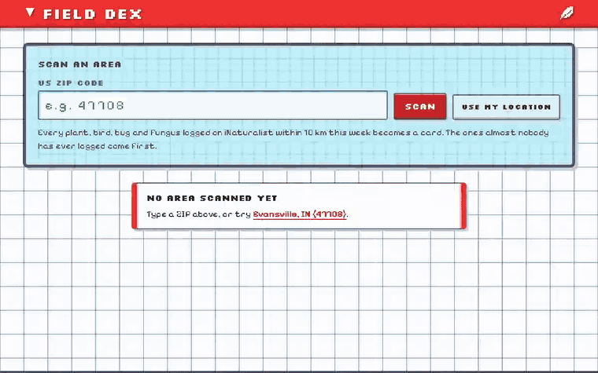

<div align="center">


# Field Dex

**A handheld-encyclopedia deck for real wildlife. Enter a US ZIP code and every species people logged on
iNaturalist within 10 km this week becomes a collectible card, rarest first.**

[](https://github.com/sdonea/fielddex/actions/workflows/daily-dex.yml)


**[Open Field Dex →](https://fielddex.vercel.app)**

[How it works](#how-it-works) · [Under the hood](#under-the-hood) · [Data](#data) · [Run it](#run-it)



</div>

Most of what lives around you has been photographed by somebody, and a surprising amount of it almost never
is. Field Dex turns a week of community sightings into a deck: the dove on your feeder is Common, the fly
someone caught on a leaf down the road might be one of a few hundred ever logged on Earth. That one goes first.

<!-- daily-dex:start -->
### Today's rarest find near Evansville, IN · 2026-10-02

<a href="https://www.inaturalist.org/taxa/143803"></a>

**low smartweed** (*Persicaria longiseta*) · **Uncommon** · 1 of 51,718 ever logged · seen 1× today · [iNaturalist page](https://www.inaturalist.org/taxa/143803)

<sub>Photo: (c) Brad Walker, some rights reserved (CC BY-NC), uploaded by Brad Walker. Updated every evening by a GitHub Action: it asks iNaturalist for every species logged
within 10 km of Evansville that day and keeps the one with the fewest observations worldwide. Every day's pick is logged in
<a href="docs/daily-dex.csv">docs/daily-dex.csv</a>.</sub>
<!-- daily-dex:end -->

## How it works

| | |
|---|---|
| **Search** | A ZIP (looked up on Zippopotam.us) or your browser's location becomes a point. One request to iNaturalist's `species_counts` returns every species observed within 10 km in the last 7 days. |
| **Type** | The species' iconic group picks its type: birds are Flying, plants Grass, insects and spiders Bug, fungi Poison, mammals Normal, reptiles Dragon, amphibians, fish and molluscs Water, anything else Mystery. |
| **Rarity** | The global observation count sets the tier: under 2,000 Legendary, under 10,000 Rare, under 100,000 Uncommon, else Common. Catch difficulty is the same number on a log scale, 5 stars at 1,000 or fewer down to 1 star at a million. |
| **Foil** | Rare and Legendary cards are holographic: the foil follows your pointer and the card tilts toward it. Pure CSS driven by two custom properties; off under `prefers-reduced-motion`. |
| **Share** | Searching by ZIP puts it in the address bar, so `?zip=47708` links straight to a deck. |
| **A README that updates itself** | Every evening a GitHub Action finds the rarest species logged near Evansville, IN that day and puts it at the top of this page ([`docs/daily-dex.csv`](docs/daily-dex.csv) keeps the history). |

## Under the hood

- **Fully static.** No backend, no database, no keys: the page calls iNaturalist and Zippopotam.us straight
  from the browser (both allow any origin), and `next build` exports plain HTML.
- **One request per search.** iNaturalist asks clients to stay near 60 requests a minute, so there's no
  polling or prefetching. It returns up to 200 species per request; denser areas show the 200 most-logged and
  say so.
- **No UI libraries.** The look (palette, panel frames, bevelled badges, tab rail, grid paper) is sampled from
  DS-era handheld encyclopedia screens and written down in [`DESIGN.md`](DESIGN.md). Pixel stars and the leaf
  icon are drawn from strings of `X`s.
- **Plain-assert checks.** `lib/dex.check.ts` pins the tier thresholds, the star scale and the type map.

| Path | What's there |
|---|---|
| `lib/dex.ts` | Types, rarity thresholds, catch stars, API URLs (shared with the daily bot) |
| `components/FieldDex.tsx` | Search, every state (loading, empty, unknown ZIP, location denied, retry), type filter |
| `components/DexCard.tsx` | The card and its pointer-driven foil |
| `scripts/daily-dex.mjs` + `.github/workflows/daily-dex.yml` | The self-updating README |

## Data

Sightings, taxa and photos from [iNaturalist](https://www.inaturalist.org), a joint initiative of the California
Academy of Sciences and the National Geographic Society. Photos are Creative Commons and every card shows its
photographer's attribution. ZIP lookup by [Zippopotam.us](https://zippopotam.us). Field Dex is a fan-made idea
riff, not affiliated with any game or franchise.

## Run it

```bash
npm install
npm run dev          # http://localhost:3000
```

Checks (Node 22.18+): `npm run typecheck`, `npm run check`. Run the daily bot by hand with
`node scripts/daily-dex.mjs` (set `DAY=YYYY-MM-DD` for another day).

---

<div align="center">Built by Sebastian "Seth" Donea · <a href="LICENSE">MIT License</a></div>
